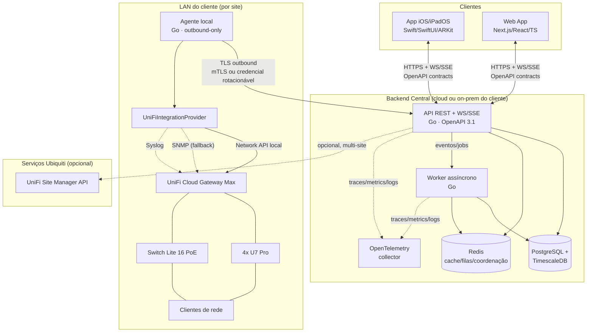
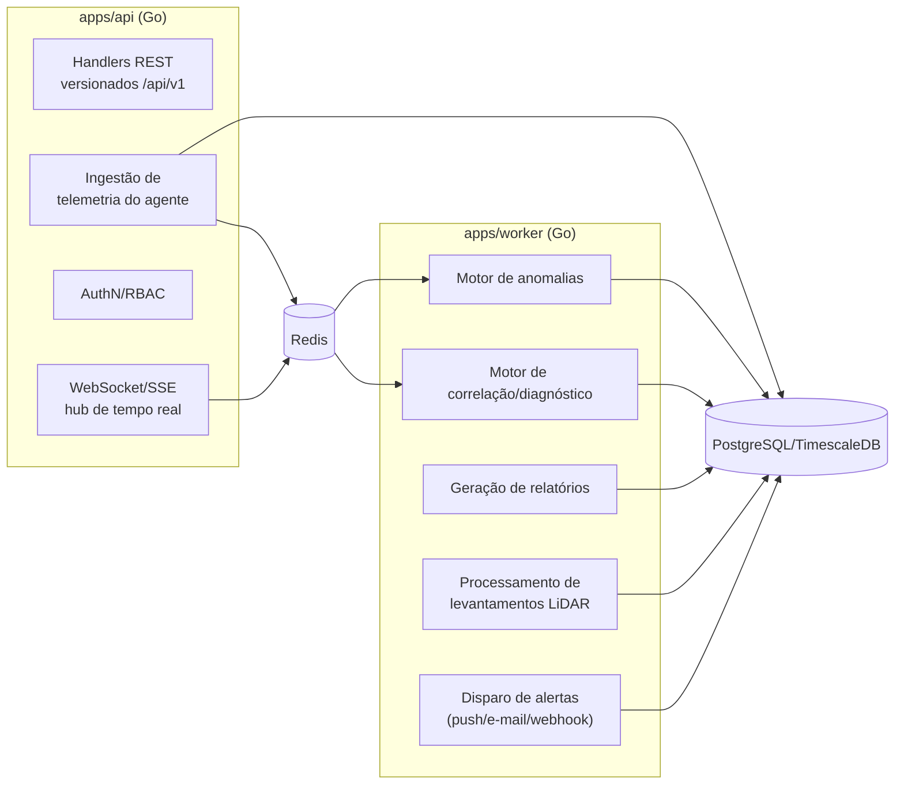
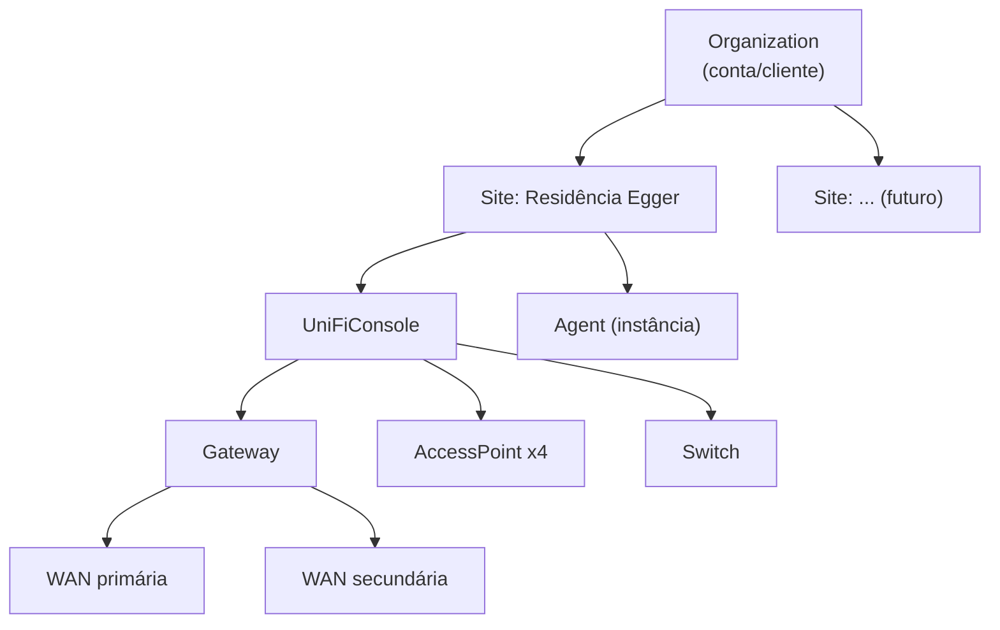

# 02 — Arquitetura Proposta

## 2.1 Visão em componentes

Pontos de leitura obrigatória deste diagrama:

- O **agente local é a única ponte** entre a LAN do cliente e o backend. A conexão é
  sempre iniciada de dentro para fora (outbound), nunca o contrário — cumpre a
  exigência de "não exigir abertura de portas de entrada" (Seção 3).
- O `UniFiIntegrationProvider` roda **dentro do agente**, não no backend central,
  porque é o agente que está na mesma LAN do console UniFi e pode falar com a Network
  API local sem expor essa API à internet.
- A UniFi Site Manager API (cloud) é **opcional** e usada apenas quando o usuário quer
  visão agregada multi-site via Ubiquiti; não é dependência obrigatória do produto.
- iOS e Web são clientes simétricos da mesma API — nenhuma lógica de negócio "mora"
  exclusivamente em um dos dois; o que muda é a superfície de interação (LiDAR só
  existe no iOS, por depender de câmera+LiDAR do aparelho).

## 2.2 Por que o agente local existe (e por que não dá para eliminá-lo)

Alternativa descartada: o backend central falar diretamente com o console UniFi do
cliente. Isso exigiria abrir porta de entrada na rede residencial ou VPN permanente
site-to-cloud — rejeitado explicitamente pela Seção 3 ("O agente local não poderá
exigir a abertura de portas de entrada"). Também exigiria que testes ativos (ping,
traceroute, iPerf3, port scan, ARP) partissem de fora da LAN, o que muda
completamente o significado da medição (latência à borda da operadora, não latência
real da LAN/Wi-Fi do cliente). Por isso o agente roda dentro da rede e "empurra"
dados/resultados para fora.

## 2.3 Camadas do backend

O worker é deliberadamente separado do processo de API: ingestão de alta frequência
(métricas do agente, heartbeats) não pode competir por CPU/latência com processamento
pesado (recalcular baseline de anomalias, processar malha LiDAR, gerar PDF de
relatório). Comunicação entre API e worker via fila no Redis (jobs leves) — sem
introduzir um broker de mensagens dedicado nesta fase (YAGNI até haver evidência de
necessidade; revisitar se o volume de eventos exigir).

## 2.4 Multi-tenancy (organização → site)

Toda entidade de negócio (métrica, evento, cliente, AP...) pertence a exatamente um
`Site`, que pertence a exatamente uma `Organization`. RBAC (Seção 18) é avaliado no
nível de organização e, quando necessário, restrito por site. Isso é o que permite
"uma ou várias instalações... vários sites UniFi... diferentes gateways" (Seção 1)
sem redesenho futuro — ver ADR-002.

## 2.5 Tempo real

WebSocket é o transporte primário para o dashboard (bidirecional, permite comandos
como "rodar teste agora"); SSE é aceito como fallback em redes/proxies corporativos
que bloqueiam WebSocket, servindo o mesmo canal de eventos em modo somente-leitura.
O hub de tempo real vive no processo de API e usa Redis Pub/Sub para escalar
horizontalmente (múltiplas instâncias de API assinam o mesmo canal por site).

## 2.6 Design system honesto (provenance badge)

Todo componente de UI (iOS e Web) que exibe uma métrica de rede deve aceitar um campo
`source` obrigatório do contrato (`packages/contracts`), com um enum fechado:
`unifi_local_api | unifi_site_manager | agent_icmp | agent_tcp | agent_udp |
agent_dns | agent_http | snmp | arkit | estimated | user_declared | unavailable`.
Quando `unavailable`, o componente renderiza o estado "Indisponível" com motivo e ação
sugerida — nunca esconde o card nem preenche com traço. Este contrato é o mecanismo
técnico que impõe o princípio da Seção 2.1 do documento original em toda a stack,
em vez de depender de disciplina manual de cada desenvolvedor.
