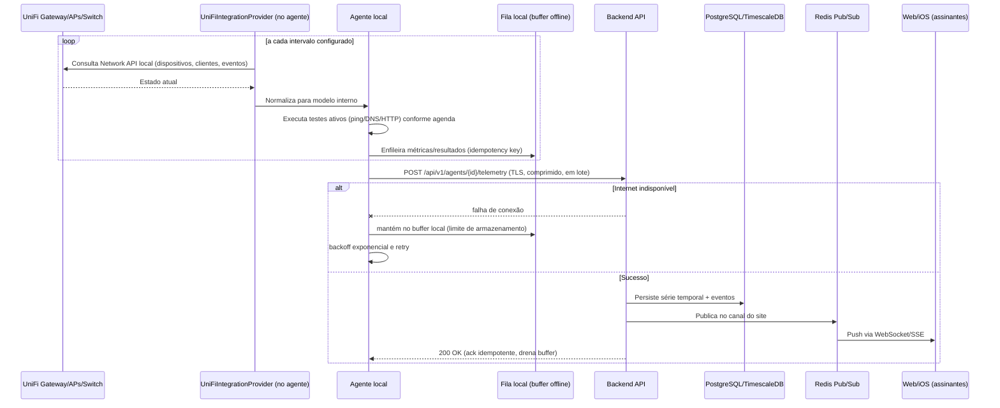
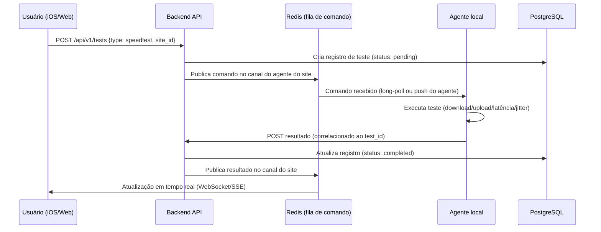
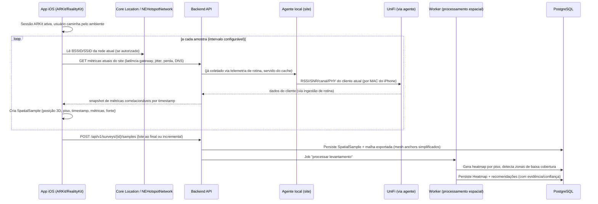
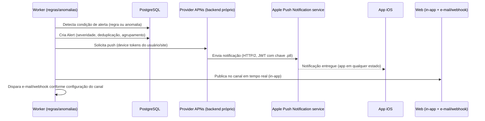

# 03 — Fluxo de Dados

## 3.1 Telemetria de rotina (heartbeat, métricas UniFi, testes programados)

Pontos de projeto:

- **Idempotência**: cada lote enviado carrega uma `idempotency key` derivada de
  `(agent_id, sequence_number)`. Reenvio após reconexão não duplica métricas —
  condição obrigatória da Seção 3 ("reenvio idempotente").
- **Buffer com limite**: o agente descarta as amostras mais antigas primeiro quando o
  buffer local atinge o teto configurado, e registra isso como evento de
  "perda de buffer local" — nunca falha silenciosamente.
- **Nenhum dado bruto de tráfego** sai da LAN (Seção 19): o que trafega para o backend
  são métricas agregadas/estruturadas (latência, contagem, estado), nunca payload de
  pacotes.

## 3.2 Teste sob demanda disparado pelo usuário (ex.: "rodar speed test agora")

O agente não expõe um servidor de comandos (isso violaria "sem porta de entrada");
ele consulta/assina o backend para saber se há comandos pendentes, usando a mesma
conexão outbound de telemetria.

## 3.3 Levantamento LiDAR (Spatial WiFi Survey)

Ponto crítico: a métrica de rádio (RSSI/SNR/canal) usada em cada amostra **não é lida
pelo iPhone** — é o valor que o UniFi reporta para o cliente (o próprio iPhone,
identificado pelo MAC) no momento mais próximo do timestamp da amostra. O app apenas
identifica *a qual AP/BSSID está associado* (via `NEHotspotNetwork`, ver limitações) e
correlaciona posição 3D + timestamp com o que o UniFi já estava reportando. Isso é
verificado com uma tolerância de sincronismo (ex.: ±5s); fora dessa janela, a amostra é
marcada com `source: estimated` e confiança reduzida, nunca apresentada como medição
direta.

## 3.4 Alertas e notificação push

Decisão registrada em ADR-009: notificações críticas usam **APNs via provider próprio
do backend** (chave `.p8`, JWT, biblioteca HTTP/2 nativa), não CloudKit
`CKQuerySubscription` — essa via é conhecida por não ser confiável em produção quando o
app está fechado. Local notifications/polling não substituem push real para alertas
como "Internet caiu" ou "AP offline".
