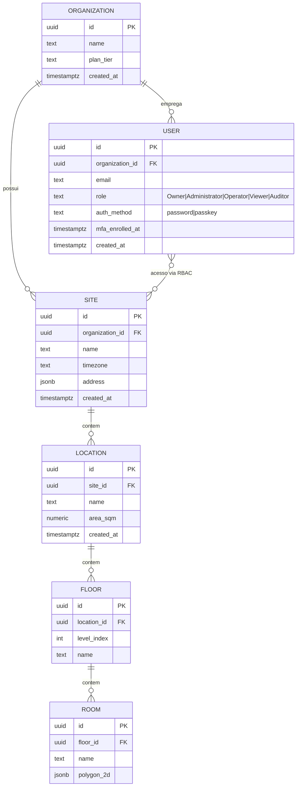
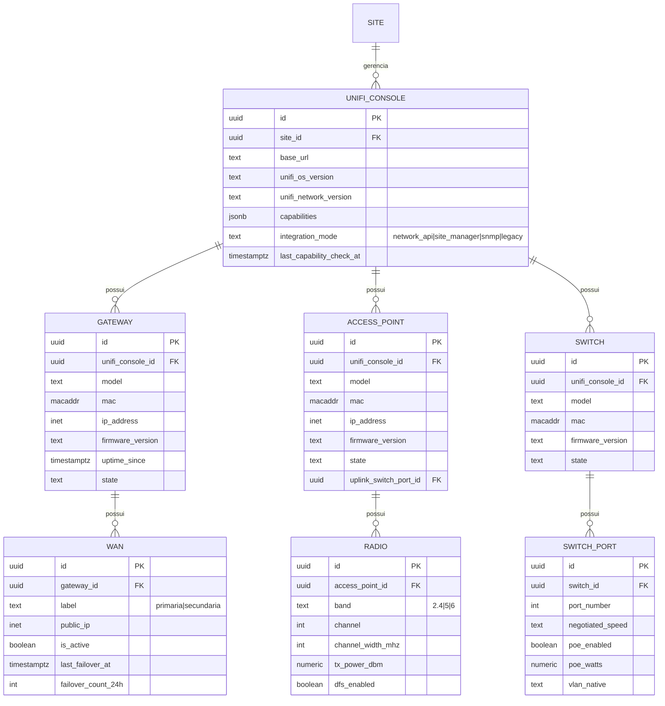
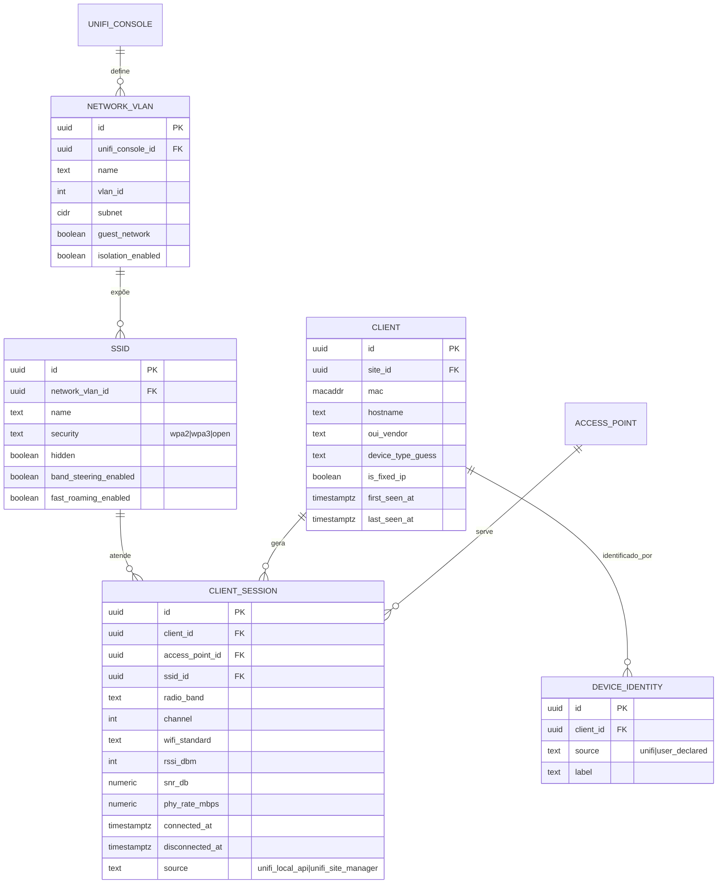
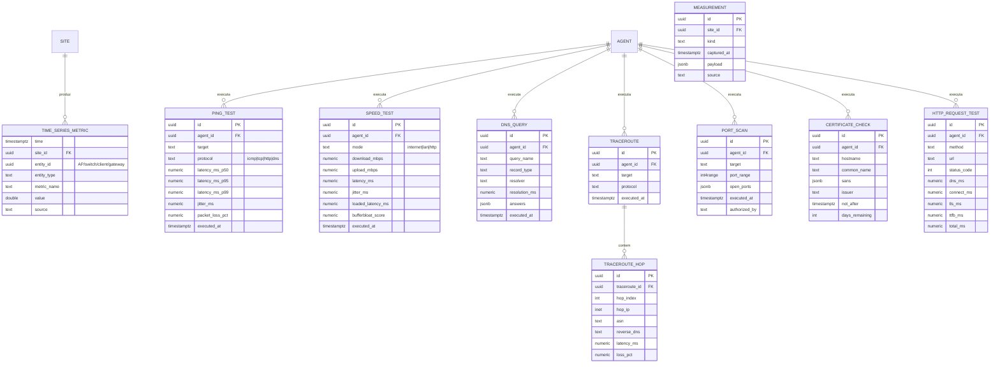
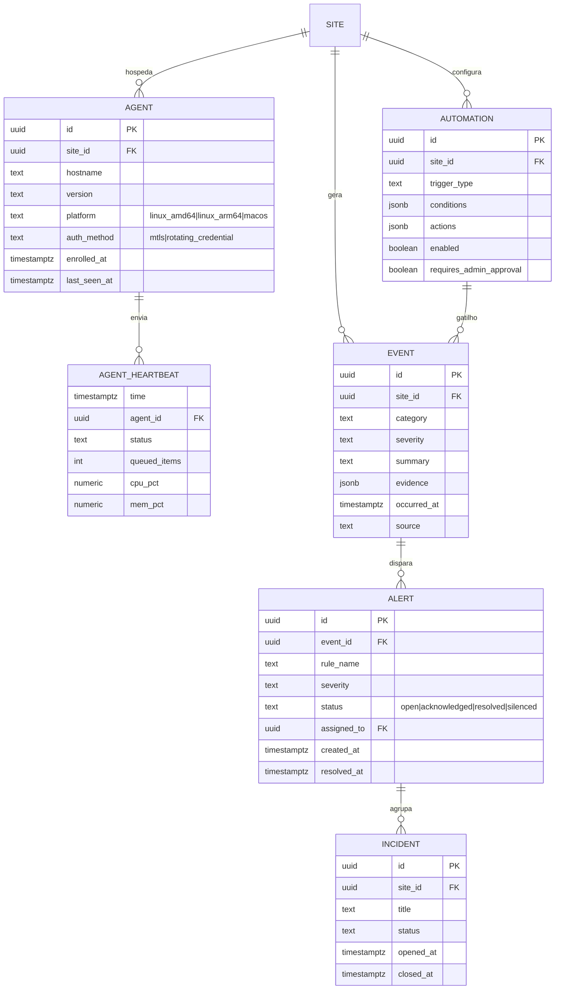
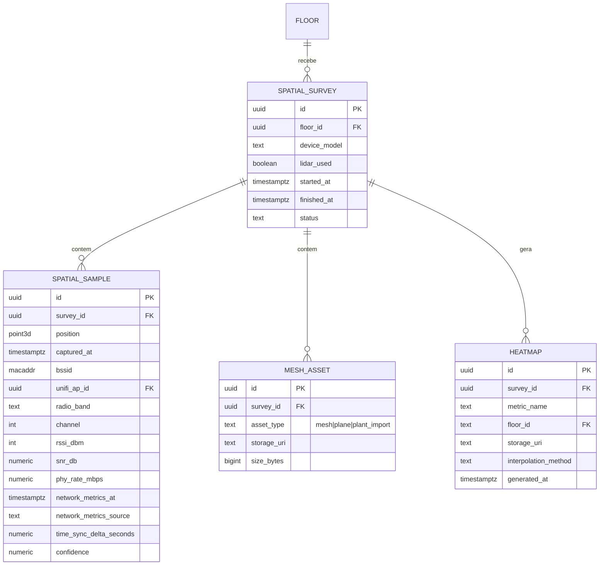
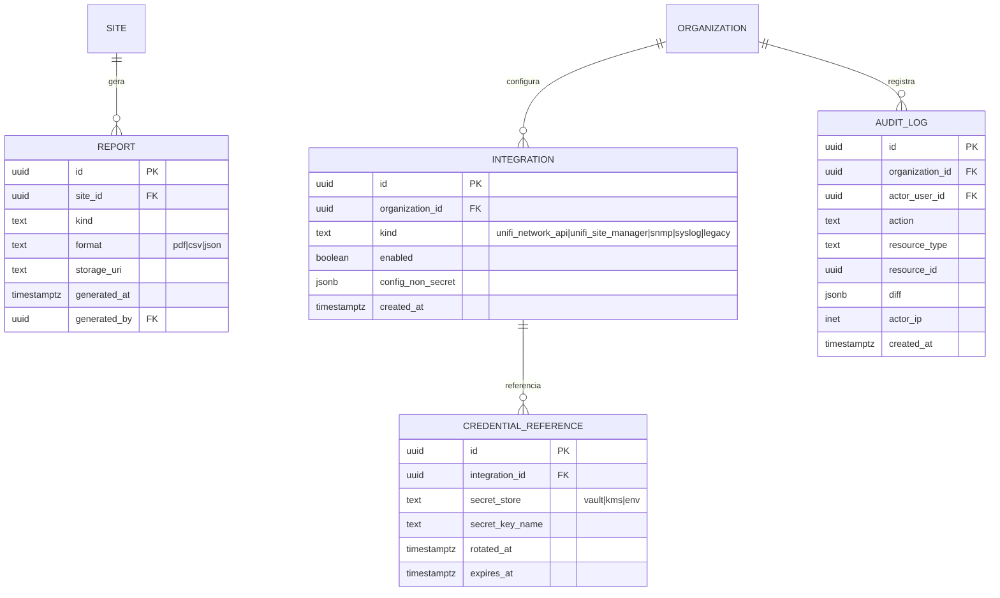

# 05 — Modelo Inicial de Banco de Dados

Convenções globais (Seção 16 do documento-fonte):

- Chave primária: `UUID` (gerado com `gen_random_uuid()`, extensão `pgcrypto`).
- Todo timestamp armazenado em **UTC** (`timestamptz`); conversão para o fuso do site
  acontece na camada de apresentação, usando `Site.timezone`.
- Toda tabela de negócio carrega `organization_id` e, onde aplicável, `site_id` —
  nunca inferido implicitamente via join; sempre uma coluna própria, indexada, para
  permitir isolamento multi-tenant no nível de query (ver threat model §2.2).
- Séries temporais de alto volume (`measurements`, testes, heartbeats) são
  hypertables do **TimescaleDB** quando disponível no ambiente de deploy; caso não
  esteja (ex.: gerenciado sem extensão Timescale), particionamento nativo do
  PostgreSQL por `time` (partição mensal) como equivalente funcional — decisão em
  ADR-004.
- Retenção: política por tipo de série temporal, configurável por organização,
  aplicada por job do worker (drop/archive de partições antigas), nunca por exclusão
  linha a linha em tabela não particionada.

## 1. Identidade, organização e local físico

## 2. Inventário UniFi

## 3. Redes lógicas, clientes e sessões

## 4. Séries temporais e testes ativos (hypertables)

## 5. Agente, eventos, alertas, incidentes, automações

## 6. Spatial WiFi Survey (LiDAR)

> **Nota (2026-08-02)**: o ER abaixo é o desenho especulativo original
> (Fase 0), tratado desde então como hipótese de partida, não contrato —
> ver `06-roadmap.md` Fase 6. O esquema **realmente implementado**
> (migração `0016_spatial_surveys`) é deliberadamente mais simples:
> `spatial_surveys` (id, site_id, created_by, name, device_model,
> lidar_used, started_at, finished_at) e `spatial_survey_samples` (id,
> survey_id, position_x/y/z, ssid, bssid, rtt_ms, is_expensive,
> is_constrained, interface_type, captured_at) — sem `bssid`/`radio_band`/
> `channel`/`rssi_dbm`/`snr_db`/`phy_rate_mbps`/`confidence` por amostra,
> sem `FLOOR`/`MESH_ASSET`/`HEATMAP`. Motivo: nenhuma fonte real disponível
> hoje expõe RSSI/canal/PHY rate por cliente (nem a Network API local do
> UniFi, nem o iOS) — persistir esses campos seria coluna sem dado real
> pra popular. Revisitar este ER se uma dessas fontes passar a expor esses
> campos (nova versão da Network API do UniFi, ou adaptador SNMP/legado
> habilitado).

## 7. Relatórios, integrações e auditoria

## Nota sobre `CredentialReference`

Nenhuma tabela armazena segredo em texto claro. `CredentialReference` guarda apenas
o **nome/localização** do segredo em um cofre externo (Vault, KMS ou variável de
ambiente do agente/backend) — cumpre "segredos fora do código-fonte" e "armazenamento
seguro" (Seção 2.2) desde o desenho do schema, não como reforço posterior.

## Índices e particionamento (a formalizar nas migrações da Fase 1)

- `time_series_metric`, `agent_heartbeat`: hypertable por `time`, chunk padrão de 1 a 7
  dias conforme volume real observado.
- `client_session`, `event`, `audit_log`: índice composto `(site_id, created_at desc)`
  ou equivalente, para os padrões de consulta mais comuns do dashboard (janelas de
  tempo por site).
- `ping_test`, `speed_test`, `traceroute`: índice em `(agent_id, executed_at desc)`.

Este documento é o modelo **inicial** — o schema definitivo com tipos exatos,
constraints e migrações versionadas (`infrastructure/database`) é produzido na
Fase 1, após confirmação dos campos reais disponíveis na API UniFi da instalação
(ver `docs/unifi/verificacoes-pendentes-instalacao.md`), que pode adicionar ou
remover colunas de `RADIO`, `SWITCH_PORT` e `CLIENT_SESSION`.
